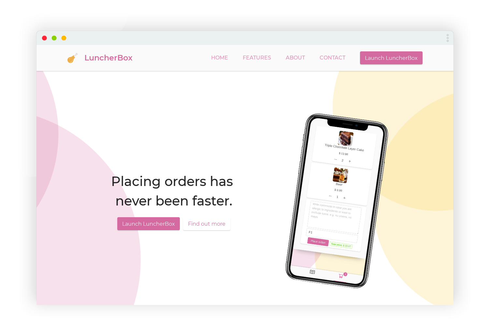

# luncher-box   

:poultry_leg: Cheap to setup web application for making orders without having to wait for waiters.

## Getting started!

You can read the [wiki](https://github.com/DeliriumProducts/luncher-box/wiki) on how to set the project up.
