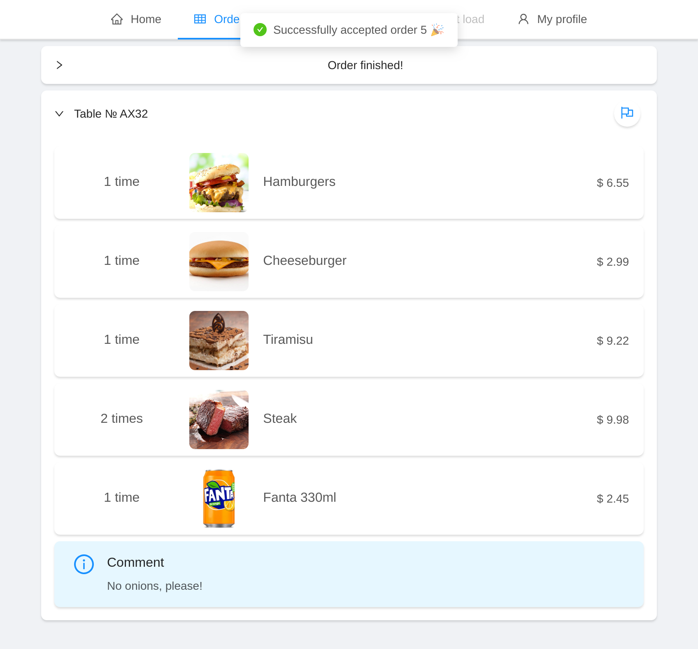
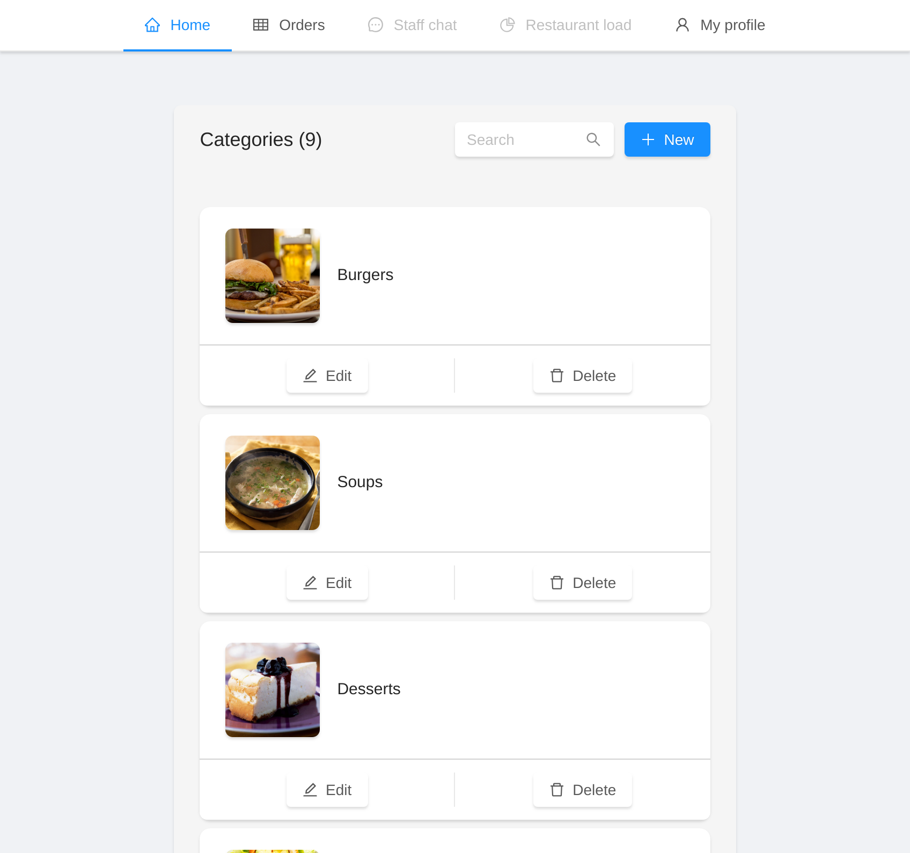

# Luncher Box

​ **Luncher Box** е уеб приложение с IoT аспект, което цели поръчването на храна от клиенти в ресторанти да става по-бързо.

​ Освен доволни клиенти, собствениците на заведението ще спестяват пари, чрез свеждане на нуждата от сервитьори до минимум. Клиентите на ресторанта ще осъществяват поръчките си, чрез **Luncher Box**, който ще изпрати заявката към кухнята, където тя ще бъде приета и обработена отново през приложението.

## Категория

​ Уеб приложение.

## Възрастова група

​ Над 16 години.

## Описание

​ Много често клиентите на ресторантите чакат прекалено дълго само за да направят поръчка. Изискват се доста сервитьори, за да обслужат всички, от това следва спад на общата ефективност на заведението.

​ С тази разработка целим намаляването или премахването на времето, нужно за чакане преди да се приемат и изпълняват поръчки в заведения. Това ще допринесе до по-висока ефективност на ресторантите, тъй като се намаля нужния брой сервитьори. Така се намалят и разходите на ресторанта. Целим се в създаването на решение, което не изисква покупката на отделно устройство за всяка маса.

​ С приложението целим да улесним живота на клиенти, чрез лесно за използване и красиво уеб приложение за правене на поръчки. Наша цел е също така да направим спестяването на пари от собствениците на ресторанти лесна задача, благодарение на намаляването на нужния брой служители.

​ В процеса на създаване на приложението, бяха прегледани множество решения, които имаха недостатъци, които ние разрешихме. Например голяма част от тях изискват покупката на отделни устройства на всяка маса - таблет, специален екран вграден в масата или други, също така почти всички имаха ужасен интерфейс. За разлика от конкуренцията, ние се целим да решим тези проблеми. Основния от тях е нуждата от покупка на отделни устройства за всяка маса. Ние разрешаваме този проблем като създадохме уеб приложение, което може да се използва от всякакъв вид устройства, стига да могат да отварят уеб страници. Самият сървър ще бъде хостван на само едно устройство (примерно [**Raspberry Pi**](https://www.raspberrypi.org/) в ресторанта), а като алтернатива може да бъде използван компютъра на заведението, ако има такъв.

​ Към текуща дата (14 февруари 2019), **Luncher Box** е завършен на $75$%.

## Screenshots

## Екип

- **Любо Любчев** - дал главната идея, работил върху frontend и backend
  - SoftUni username: **IMPZERO**, Tel. **[REDACTED]**, E-mail: [lyubo_2317@abv.bg](mailto:lyubo_2317@abv.bg)
- **Симо Александров** - работил върху frontend и backend
  - SoftUni username: **simo3003**, Tel. **[REDACTED]**, E-mail: [simo3003@me.com](mailto:simo3003@me.com)

## Демо

// TODO

## Технологии

|  Frontend  |       Backend       |   Shared   |     Miscellaneous     |
| :--------: | :-----------------: | :--------: | :-------------------: |
|  babel.js  |     passport.js     | TypeScript |        Testing        |
|  next.js   |        Jest         |    node    |        Caching        |
|  react.js  |       TypeORM       | express.js |    MySQL / MariaDB    |
|    JSX     |       ioredis       | socket.io  |         Redis         |
| CSS-in-JS  | routing-controllers |            |         HTTP          |
|  Webpack   | socket-controllers  |            |         REST          |
| VirtualDOM |   class-validator   |            |      WebSockets       |
|    PWA     |                     |            |     Raspberry Pi      |
|    SPA     |                     |            |       Sessions        |
| Ant Design |                     |            |        Cookies        |
|            |                     |            |        Docker         |
|            |                     |            | Git / Version Control |
|            |                     |            | Continous Integration |
|            |                     |            |  Domain Name System   |
|            |                     |            | Linux / Shell scripts |

## Сорс код

[DeliriumProducts/Luncher-Box](https://github.com/deliriumproducts/luncher-box)
