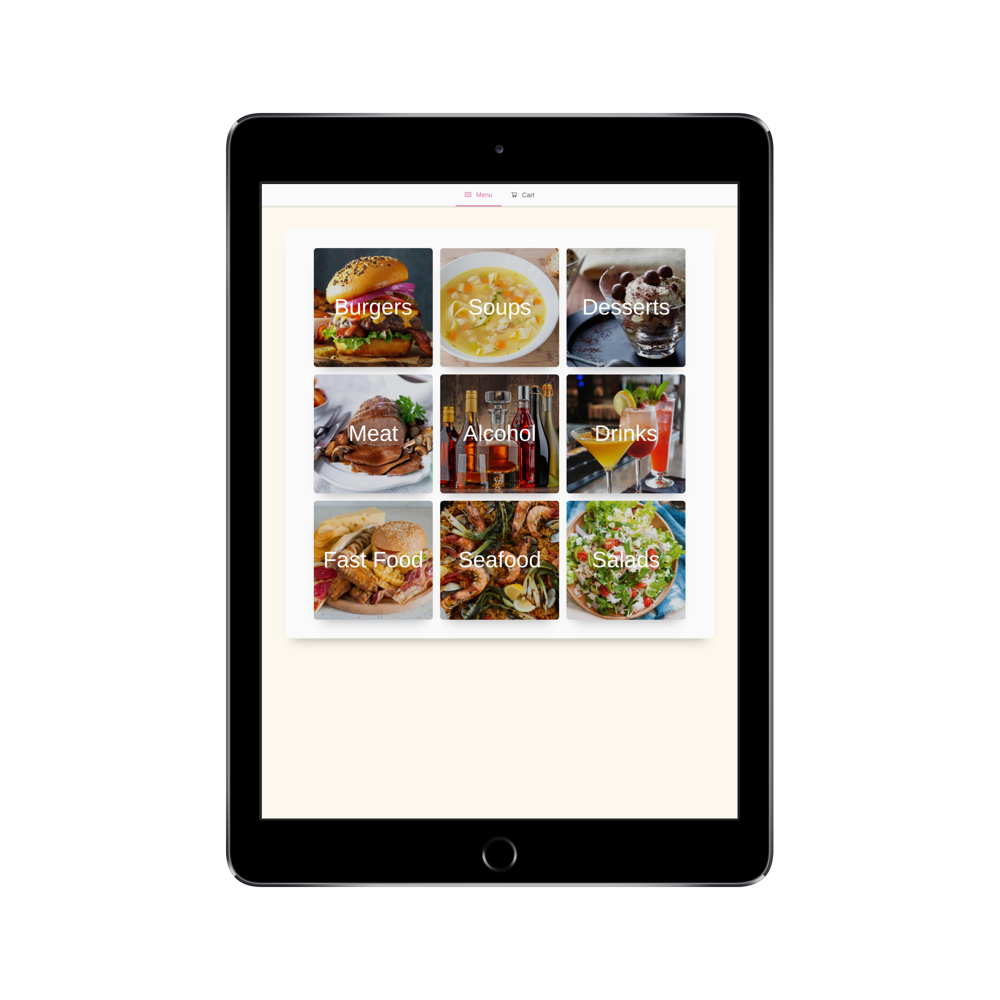
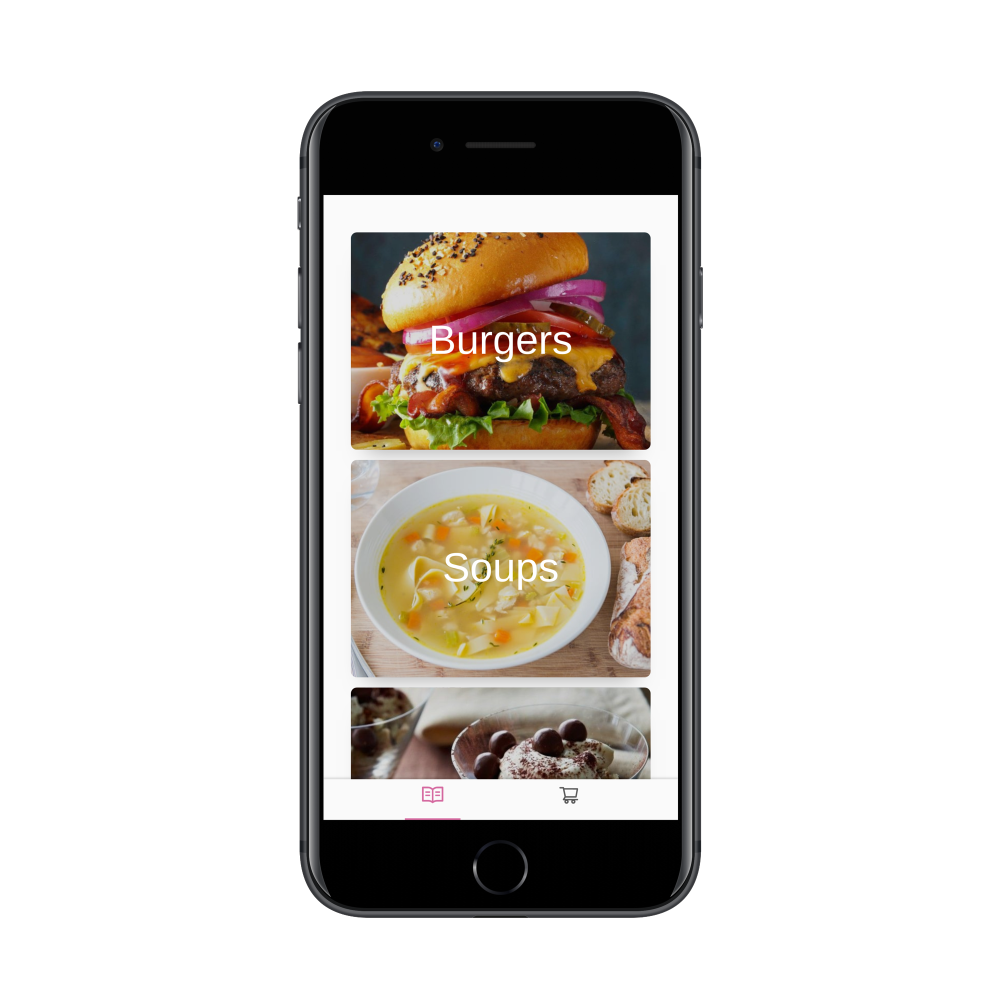
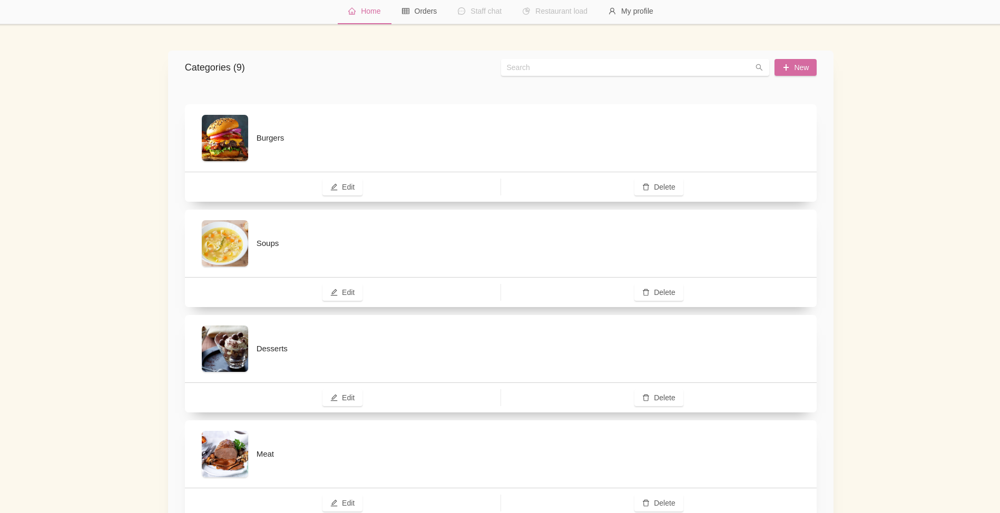

export { default as theme } from "./theme.js";
import { Split, SplitRight } from "mdx-deck/layouts";
import { Head, Image, Appear } from "mdx-deck";

# LuncherBox 🥩

<Head>
  <title>LuncherBox</title>
</Head>

Проект от Симо Александров и Любо Любчев

МГ "Баба Тонка" 10в клас

---

  <h2>Delirium Products</h2>
  <a href="https://deliriumproducts.me">deliriumproducts.me</a>

---

export default SplitRight;

## Проблемът

---

export default Split;

## Решението

---

  <h1>Етапи на развитие 👣</h1>
  <Appear>
    <li
      css={`
        font-size: 1.5rem;
        text-align: center;
      `}
    >
      Проучване на технлогии и дизайн
    </li>
    <li
      css={`
        font-size: 1.5rem;
        text-align: center;
      `}
    >
      Разработване на модерно уеб приложение
    </li>
  </Appear>

---

export default SplitRight;

## Как работи?

---

export default Split;

  <Appear>
    <h1>Технлогии и архитектура</h1>
    <li>TypeScript, React.js, Next.js, Ant Design</li>
    <li>Node.js, Express.js, TypeORM, Socket.io</li>
    <li>MariaDB (MySQL), Redis, Nginx</li>
    <li>Raspberry Pi, Docker</li>
  </Appear>

---

export default SplitRight;

  <h1>Функции </h1>
  <Appear>
    <li>Лесен, красив, бърз и интуитивен интерфейс за всички резолюции</li>
    <li>Административен панел</li>
    <li>Потребителски панел</li>
    <li>Правене и отказ на поръчка към кухнята без нужда от регистрация</li>
    <li>Статус на поръчката</li>
    <li>Автоматично запазване на продуктите в количката.</li>
  </Appear>

---

# Демонстрация

<a href="https://luncherbox.deliriumproducts.me">luncherbox.deliriumproducts.me</a>

---

# Конкуренция 👊

---

# Заключение и бъдеще

---

# Благодарим за вниманието!
