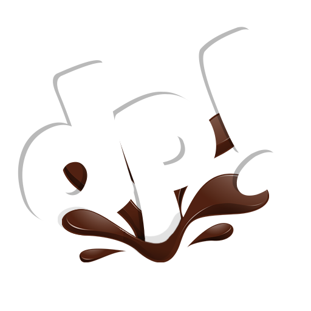
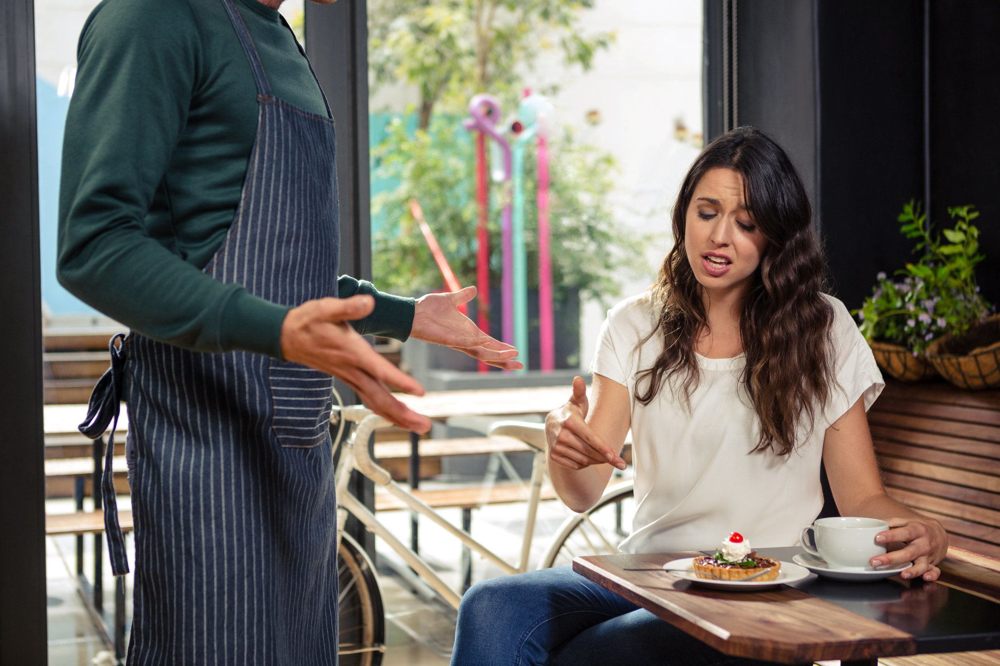
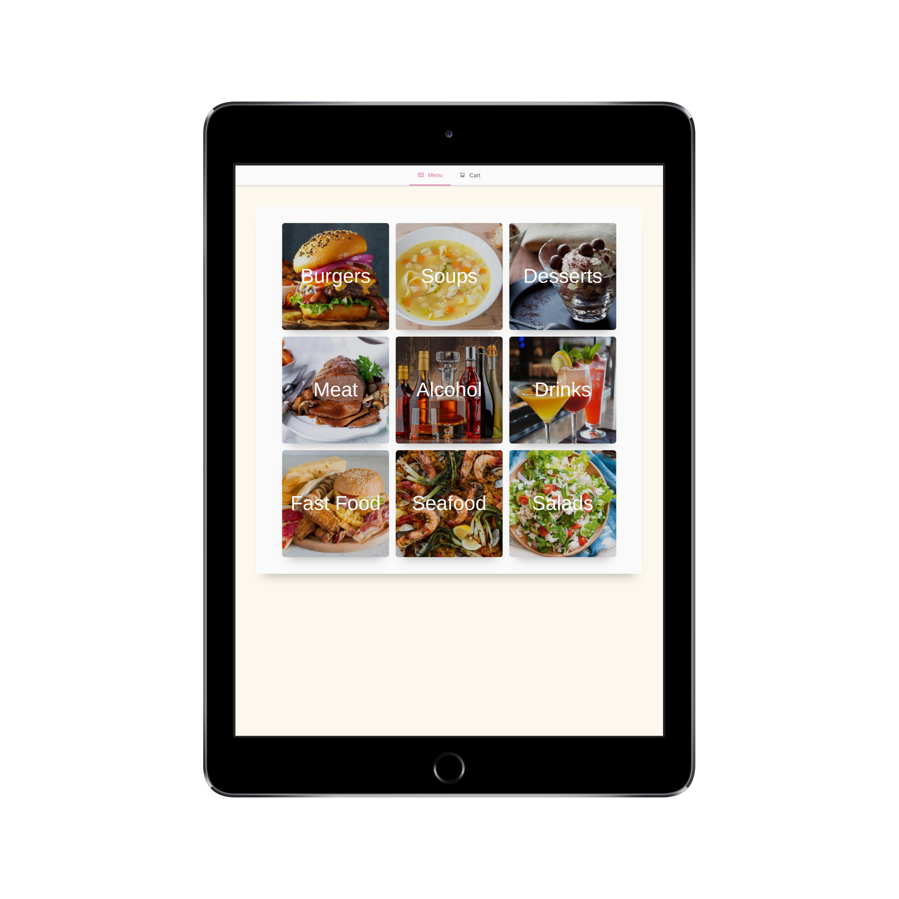
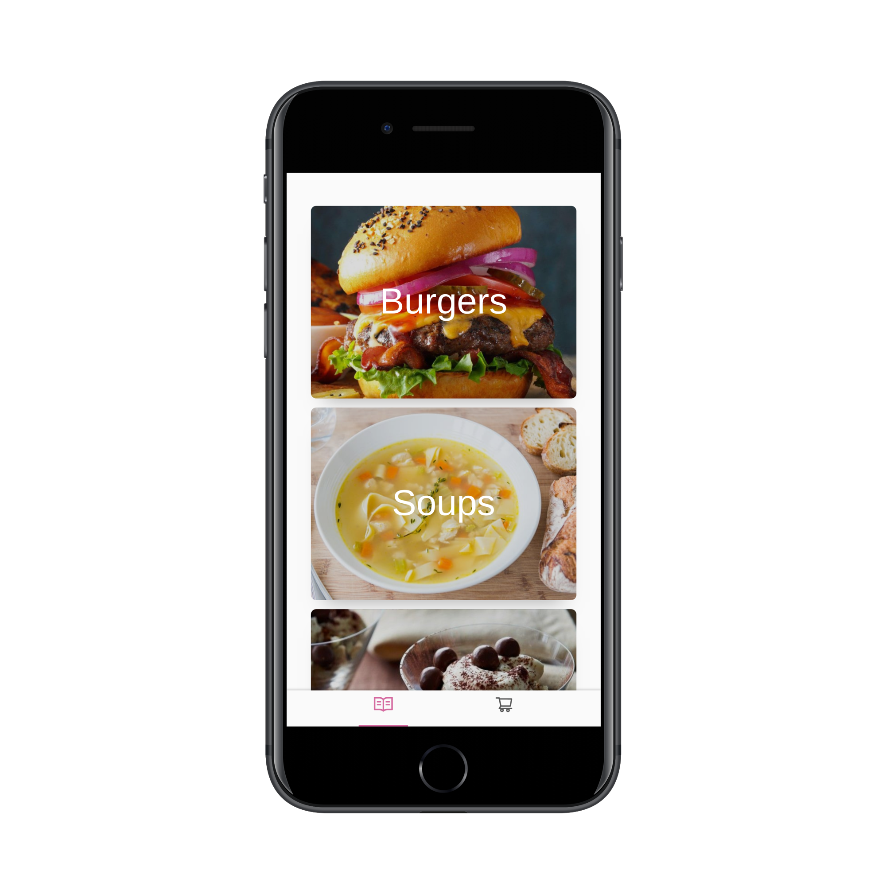
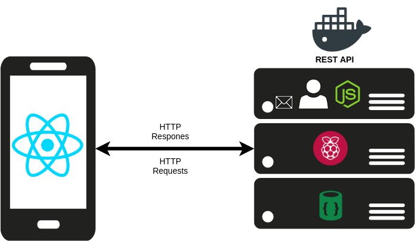
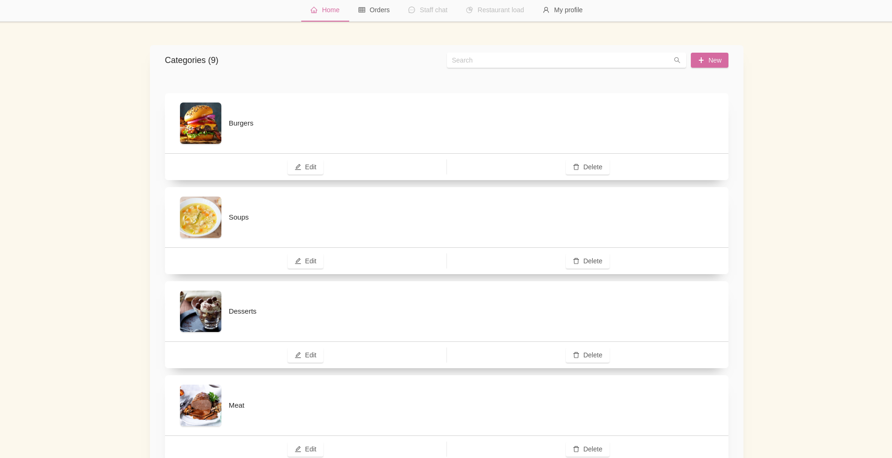

export { default as theme } from "./theme.js";
import { Split, SplitRight } from "mdx-deck/layouts";
import { Head, Image, Appear } from "mdx-deck";

# LuncherBox 🥩

<Head>
  <title>LuncherBox</title>
</Head>

Проект от Симо Александров и Любо Любчев

МГ "Баба Тонка" 10в клас

---

  <h2>Delirium Products</h2>

---

export default SplitRight;

## Проблемът

---

export default Split;

## Решението

---

export default SplitRight;

## Как работи?

---

export default Split;

  <Appear>
    <h1>Технлогии и архитектура </h1>
    <li>TypeScript, React.js, Next.js</li>
    <li>Express.js, TypeORM, Passport.js</li>
    <li>MariaDB (MySQL), Redis, Nginx</li>
    <li>Raspberry Pi</li>
  </Appear>

---

export default SplitRight;

  <h1>Функции </h1>
  <Appear>
    <li>Лесен, красив, бърз и интуитивен интерфейс за всички резолюции</li>
    <li>Административен панел</li>
    <li>Потребителски панел</li>
    <li>Директен достъп до менюто на ресторанта</li>
    <li>Правене и отказ на поръчка към кухнята без нужда от регистрация</li>
    <li>Статус на поръчката</li>
    <li>Автоматично запазване на продуктите в количката.</li>
  </Appear>

---

# Демонстрация

---

export default Split;

# Бъдеще

---

# Благодарим за вниманието!
