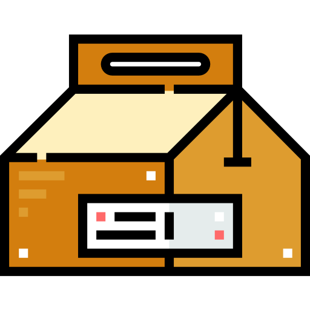
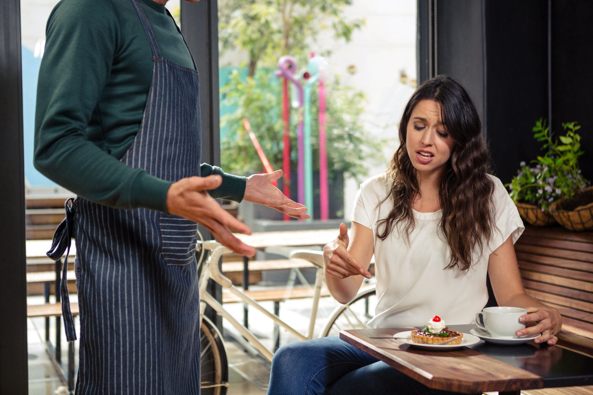
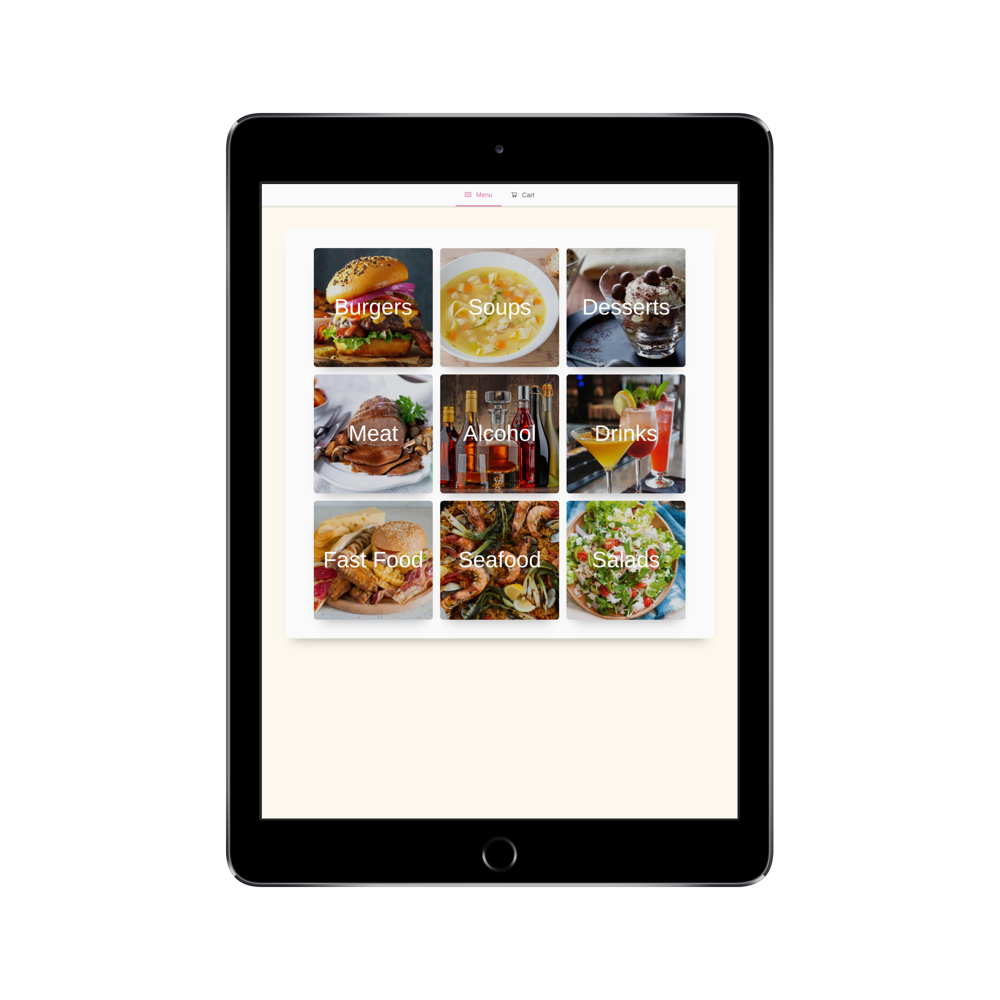
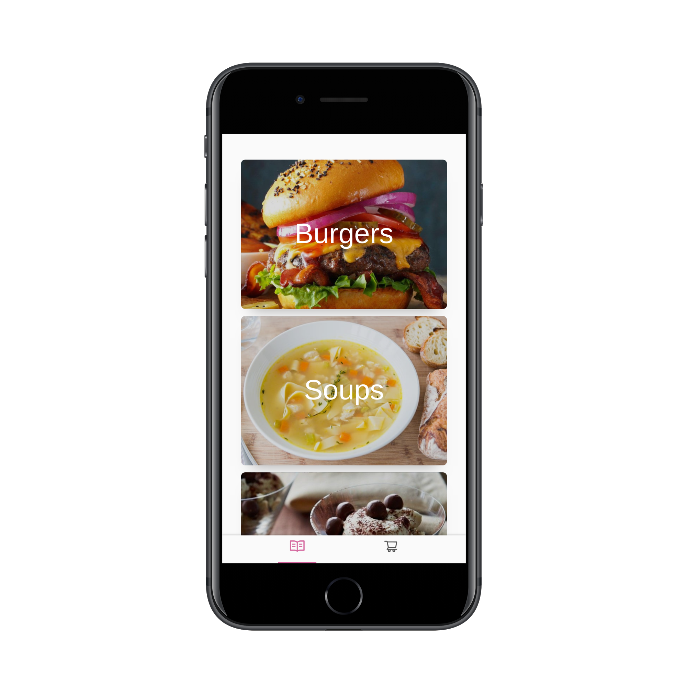
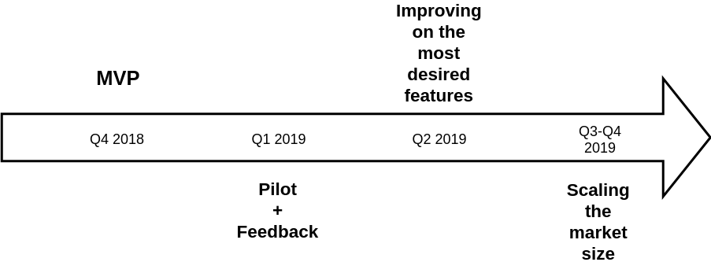
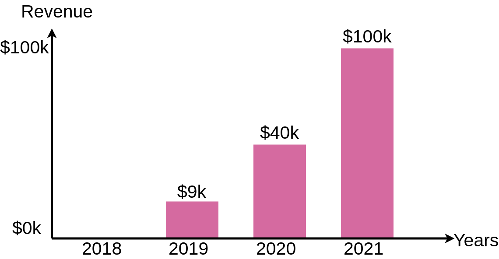
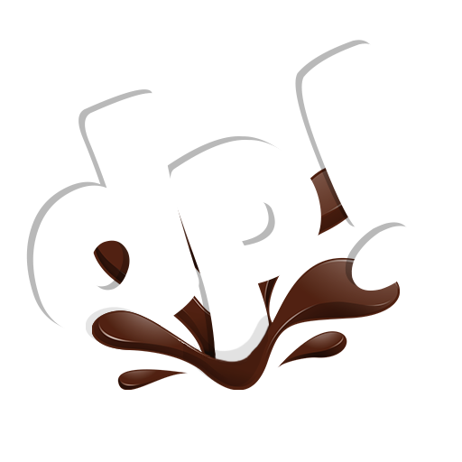

export { default as theme } from "./theme.js";
import { Split, SplitRight } from "mdx-deck/layouts";
import { Head, Image, Appear } from "mdx-deck";

<h1>LuncherBox</h1>

<b>luncherbox.deliriumproducts.me</b>

A project by Delirium Products!

---

export default SplitRight;

## The problem

---

export default Split;

## The solution

---

export default SplitRight;

## How does it work?

---

# Features

<ul>
  <li>🍩 Easy, beautiful, fast, responsive and intuitive interface.</li>
  <li>🍦 Admin Panel.</li>
  <li>🍔 Customer Panel.</li>
  <li>🥧 Placing and canceling orders without the need of a registration.</li>
  <li>🍫 Order status.</li>
  <li>🍕 Automatic saving of items in the cart.</li>
  <li>👨‍🍳 Creating, editing and deleting products to your heart's content!</li>
  <li>📱 Use on any device.</li>
  <li>📶 Web based - just open from your browser!</li>
</ul>

---

# Bussiness model 💸

<ul>
  <li>💰 Restaurant owners don't need to pay for hardware.</li>
  <li>📊 Monthly subscription</li>
  <ul>
     
    <li>🐁 70 BGN - For small restaurants (up to 50 people)</li>
    <li>😼 100 BGN - For medium restaurants (up to 100 people)</li>
    <li>🦁 200 BGN - For large restaurants (200+ people)</li>
  </ul>
</ul>

---

# Roadmap 🗺

---

# Pilot

---

# Revenue

<ul>
  <li>
    2019 - <b>9</b> Small, <b>1</b> Medium
  </li>
  <li>
    2020 - <b>30</b> Small, <b>9</b> Medium <b>1</b> Large
  </li>
  <li>
    2021 - <b>60</b> Small, <b>20</b> Medium <b>10</b> Large
  </li>
</ul>

---

# What we need

<ul>
  <li>👨‍💻 Testers</li>
  <li>🖌️ Graphic designer</li>
  <li>📈 Marketing person</li>
  <li>📝 Mentor</li>
  <li>🏢 Office (maybe? 😃)</li>
</ul>

---

# Contact

- You can contact us as **office@deliriumproducts.me**
- Follow us at **github.com/deliriumproducts**

---

# Thanks!

- You can try the application out on
- **luncherbox.deliriumproducts.me**
