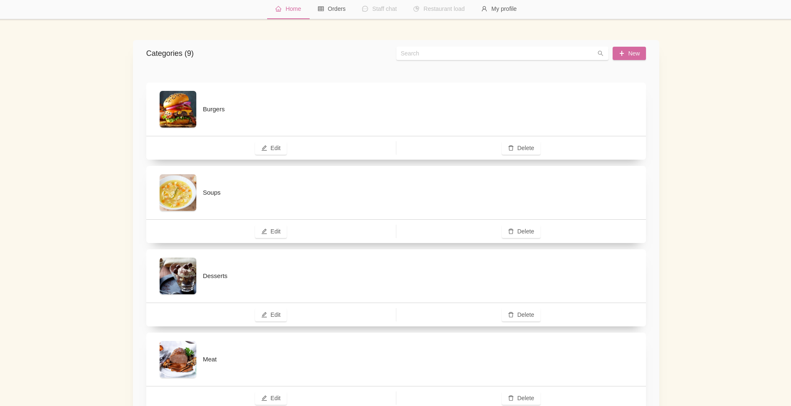

export { default as theme } from "./theme.js";
import { Split, SplitRight } from "mdx-deck/layouts";
import { Head, Image, Appear } from "mdx-deck";

# LuncherBox 🥩

<Head>
  <title>LuncherBox</title>
</Head>

A project by Simo Aleksandrov & Lyubo Lyubchev

---

  <h2>Delirium Products</h2>
deliriumproducts.me

---

export default SplitRight;

## The problem

---

export default Split;

## The solution

---

export default SplitRight;

## How does it work?

---

export default SplitRight;

  <h1>Features </h1>
  <li>Easy, beautiful, fast, responsive and intuitive interface</li>
  <li>Admin Panel</li>
  <li>Customer Panel</li>
  <li>Placing and canceling orders without the need of a registration</li>
  <li>Order status</li>
  <li>Automatic saving of items in the cart</li>

---

# Bussiness plan 💸

---

# Future and conclusion

---

# Thanks for your attention!

You can try the application out on

**luncherbox.deliriumproducts.me**

